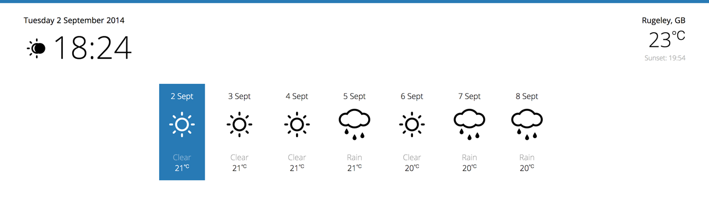

# ForwardDash

[](https://travis-ci.org/tawashley/ForwardDash)
[](https://david-dm.org/tawashley/ForwardDash#info=devDependencies)

> Widget powered, web based dashboard using HTML, CSS and JS



- [Getting Started](#getting-started)
- [Adding Widgets](#adding-more-widgets)
- [Creating a new widget](#creating-a-new-widget)
- [Widget Manager](#widget-manager)
- [Helper Functions](#helper-functions)
- [Current Limitations](#current-limitations)

A Web Dashboard built using widgets - built with a focus on the developer, allowing freedom of structure and behavior with the look and feel being controlled programatically. You will find no fancy UI for dragging and dropping widgets here nor will you find menus for removing or adding widgets - all of this is done in the code, examples of which can be found below.

This is all in the aim of giving a developer power over a widget's structure, look and behaviour and removing unecessary abstraction through the interface. Want more than one clock displayed on the dashboard with their own seperate options, done!

There are currently three default widgets

* ClockWidget
* CurrentWeatherWidget
* ForecastWeatherWidget

Widgets are designed to be modular, having their own markup, style
s and behaviour and with the ability to make easily configurable. Don't need seconds to be displayed on the clock, flip the config flag.

Once all desired widgets have been added to the dashboard directory, a simple script defining the User Interface and the Widgets to include is all that is needed.

When defining individual widgets, global options can be set such as the size of the widget and the position, as well as the config object for the widget to interact with.

## Getting Started

Getting a single widget dashboard up and running is super quick, though running it on a server (local or whatever takes you fancy) is advisable. All is needed is a HTML document and a script file (or several depending on if developing) to get the ball rolling.

index.html

```html
<!DOCTYPE html>
<html>
<head>
    <meta charset="UTF-8">
    <title>Dashboard</title>
</head>

<body>
    <div id="ForwardDash" class="ForwardDash"></div>
</body>

<!-- common widget helpers -->
<script src="/dashboard/core/scripts/modules/WidgetHelpers.js"></script>

<!-- widget object used for each individual widget -->
<script src="/dashboard/core/scripts/modules/Widget.js"></script>

<!-- widget manager responsible for all the heavy lifting -->
<!-- id is required and should not be changed -->
<script src="/dashboard/core/scripts/modules/WidgetManager.js" id="ForwardDashScript"></script>

<!-- script that brings it all together-->
<script src="/dashboard/core/scripts/modules/ForwardDash.js"></script>

</html>
```

main.js
```js
document.addEventListener("DOMContentLoaded", function(){

    //instantiate the dashboard handler
    var Manager = WidgetManager();

    Manager.defineRow({
        widgets: [
            Widget({
                //this must be the same as the widget folder
                name: 'ClockWidget'
            })
        ]
    })

    //commit all additions and render widgets on-screen
    Manager.renderWidgets();

}, false);
```

The defineRow() function accepts an object with one key being an array of objects for each widget of that row. The minimum required data for a widget to work is it's name (the exact name of the widget's folder name)

## Adding more widgets

More widgets and rows with widgets can easily be added by expanding the widgets array.

```js
Manager.defineRow({
    name: 'ClockAndDate',
    widgets: [
        Widget({
            name: 'ClockWidget',
            size: 'half',
            config : {
                clock: {
                    showSeconds: false,
                    // showTimeOfDayIcon: false,
                    // TwelvehourClock: true
                },
                date: {
                    // showDate: true
                    // showYear: false
                    // shortDay: true
                    // shortMonth: true
                }
            }
        }),
        Widget({
            name: 'CurrentWeatherWidget',
            position: 'right',
            config: {
                celsius: true,
                showMinMaxTemp: false,
                // showSunrise: false,
                showSunset: true
            }
        })
    ]
})

Manager.defineRow({
    name: 'ForecastRow',
    position: 'left'
    widgets: [
        Widget({
            name: 'ForecastWidget',
            size: 'full',
            config: {
                celsius: true,
                // showTemp: false,
                // showForecastDescription: false,
                // hightlightTodaysForecast: false
            }
        })
    ]
})
```

The above code will render the 'ClockWidget' and 'CurrentWeatherWidget' on one row and the 'ForecastWidget' on the row below it. When adding a widget extra properties can be also be provided such as 'position' or 'size' (how much space it takes up of the row). A config object that is exposed to the widget script can also be defined here and allows for control over the display and behaviour of any given widget.

Better yet, want to have multiple instances of the same widget on the dashboard, all with their own configs? Making this so is as easy as pie.

```js
Manager.defineRow({
    name: 'ClockAndDate',
    widgets: [
        Widget({
            name: 'ClockWidget',
            size: 'half',
            config : {
                clock: {
                    showSeconds: false,
                },
                date: {
                    showDate: false
                }
            }
        }),
        Widget({
            name: 'ClockWidget',
            position: 'right'
            config : {
                clock: {
                    showSeconds: true,
                    TwelvehourClock: true
                },
                date: {
                    showDate: true
                    showYear: false
                    shortDay: true
                    shortMonth: true
                }
            }
        }),
    ]
})
```

## Creating a new widget

All widgets are stored in the 'dashboard/widgets' directory and individual widgets have their own folder containing one HTML, CSS and JS files namespaced with the widget name.

For example, all code for a widget called 'FooBar' would be in a folder called 'FooBarWidget' ('Widget' as a suffix is required to work) and may contain the files:

* FooBarWidget.html - structure
* FooBarWidget.css - appearance
* FooBarWidget.js - behaviour

This strucutre can be seen for the default dashboard widgets.

FooBarWidget.html

```html
<div data-widget-foobar class="foo-bar-container widget-container"></div>

<!-- href must be relative to index.html -->
<link rel="stylesheet" href="dashboard/widgets/FooBarWidget/FooBarWidget.css">
```

To allow for multiple instances of a widget it is advised to not use ids in the HTML file, with data attributes seen as a better hook if required.

FooBarWidget.js

```js
function FooBarWidget(dashboard) {

    //dashboard contents

    //dashboard.container -> the HTML Element for the widget container
    //dashboard.helpers -> All helper functions
    //dashboard.Widgetconfig -> config object for this widget instance

    var exports = {};

    ...

    //Single public function. This function is called during renderWidgets()
    exports.init = function() {
        //GO GO GO WIDGET!
    };

    return exports;
};
```

When declaring a widget function a config object and a helpers object is passed into it. These are passed to the function by the `WidgetManager` and represent the `config` object when defining a widget and helpers as an instance of `WidgetHelpers` [helper functions](#helper-functions)

A widget stylesheet is optional, with only .html and .js being required

## Widget Manager

The manager is the glue that brings together the widgets and the dashboard.

The program lifecycle is:

1. Define rows and inside of here define widgets to be contained in the row.
2. Commit the dashboard widgets by calling the `renderWidgets()` function.
3. Internally the WidgetManager will render each row, pull in each widgets structure and script, invoke each widget's .init() function and show the newly rendered dashboard once all widgets have been loaded.

### Methods

#### defineRow(rowData)

rowData `Object`

Define a single dashboard row.

#### rowData Properties

##### name

Type: `String`

Optional name for a row. This name is added to the widget markup.

##### widget

Type `Array`

An array of objects containing an object for each widget for the row. More information can be found in [Adding Widgets](#adding-more-widgets)

#### renderWidgets()

Commit dashboard widgets and render the dashboard

#### setLoadingMessage(message)

message `String`

Display a loading message whilst dashboard widgets are being loaded. If a message is not set, none is shown.

This function must be called before `renderWidgets()`

## Helper Functions

`WidgetHelpers` are a collection of common functions avaiable to widgets that help with tasks such as making async requests or getting the user current location using geolcation.

### Methods

### General Helpers

#### helpers.asyncRequest(data)

data `Object`

Async request helper function which returns a JavaScript promise.

```js
helpers.asyncRequest({
    method: 'GET',
    type: 'json', //defaults to text
    uri: 'xhr-request.co.uk'
}).then(function(response){
    //do something with the response
});
```

#### helpers.getLocation(data)

data `Object`

Get the user's current location using `navigation.geolocation`.

```js
helpers.getLocation({
    options : {
        enableHighAccuracy : true,
        timeout : 10000, // 10 seconds
        maximumAge : 0 //spec default is 0
    },
    completeCallback: function(position) {
        //location successful
    },
    errorCallback: function(message, error) {
        //location error
    }
})
```

### Configuration Helpers

#### helpers.config.setValue(value, default_value)

default_value `String`

This function can be used to check if `value` is null and if so, return `default_value`. This can be helpful when creating a widget config option which requires a default value.

#### helpers.config.isUndefined(value)

value `String`

Simple function to check if provided value is undefined, simple.

### Date Helpers

#### helpers.date.getDayString(day_number, short_day)

day_number `Int`, short_day `Boolean`

Function for getting the day string from `date.getDay()` call.
A short day (e.g. Mon) can be returned by passing `short_day` as true

#### helpers.date.getMonthString(month_number, short_month)

month_number `Int`, short_month `Boolean`

Function for getting the month string from `date.getMonth()` call.
A short month (e.g. Sept) can be returned by passing `short_month` as true

## Current Limitations

* By it's very design, once the dashboard has been rendered and the UI created - adding, removing, repositioning etc. widgets is accompished by changing the underlying code, not by clicking on UI controls.

* Due to the dashboard lifecycle, each widget has it's own seperate CSS, JS and HTML file. While the structure is added to the page in an XHR request, this is not the case with CSS and JS. Without a build system in place to minify and concat widget files there may be a situation where 10+ individual CSS and JS files are loaded, at once, when the dashboard is being rendered. As such performance may become an issue in this situation.
